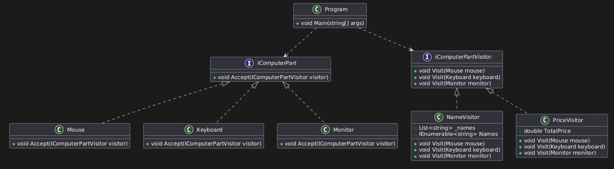

# VisitorDesignPattern

Visitor Design Pattern is a behavioral design pattern that allows you to separate algorithms from the objects on which they operate. This pattern lets you define a new operation without changing the classes of the elements on which it operates. The Visitor pattern provides a way to add operations to a group of related objects by defining a visitor class that implements those operations.

**Real world applications of Visitor design pattern**

- Compilers: Using visitors to traverse abstract syntax trees for operations like code generation and type checking.
- File System: Applying operations like file size calculation or compression to different types of files in a directory hierarchy.
- Graphics Software: Rendering, transforming, or exporting various shapes (e.g., circles, rectangles) without modifying the shape classes.
- Data Export: Converting different elements of a data structure (e.g., XML, JSON, CSV) into various output formats without altering the original classes.
- Shopping Cart: Calculating total prices or generating discount reports for different product types (e.g., electronics, groceries) in a shopping cart system.

# Design

This project demonstrates the **Visitor design pattern** by separating operations from the elements they act upon. It features a linked list navigator of computer parts (`Mouse`, `Keyboard`, `Monitor`) that allows external operations like calculating total price (`PriceVisitor`) or collecting part names (`NameVisitor`). The design is flexible and extensible, enabling new operations to be added without modifying the existing element classes.

Here,
- 'A' represents abstract class.
- 'C' represents concrete class.
- 'I' represents interface class.

# Environment
The project builds and runs with Visual Studio Community 2022 when the required workloads are installed.
